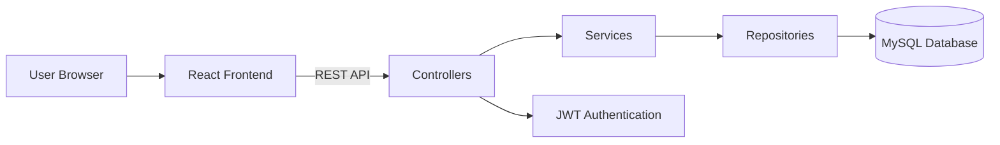
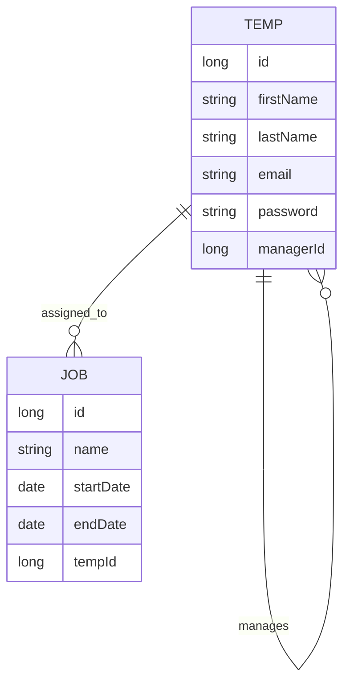
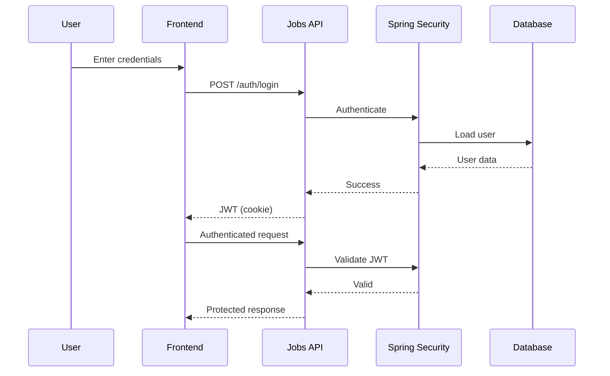

# Jobs API

REST API for managing temporary workers and job assignments with hierarchy-based access control.

Built with Spring Boot, Spring Security, JWT authentication and MySQL.

## Features

- JWT authentication (httpOnly cookie-based)
- Temp hierarchy management
- Job creation and assignment
- Profile management
- Hierarchy-based visibility rules
- Pagination support
- Sorting (jobs: date/name, temps: name/id/job count)
- Validation and structured error handling
- Dev data seeding

## Architecture



The backend exposes REST endpoints consumed by the React frontend.  
Authentication is handled using JWT tokens through Spring Security.  
Business logic such as hierarchy visibility and assignment rules is enforced in the service layer.

## Tech Stack

Java  
Spring Boot  
Spring Security  
Spring Data JPA  
JWT Authentication  
MySQL  
Maven  

## Project Structure

    src/main/java/com/example/jobs
    ├── controller
    ├── service
    ├── repository
    ├── dto
    ├── entity
    ├── security
    ├── config
    └── exception

    src/main/resources
    ├── application.properties

## Database ER Diagram



## JWT Authentication Flow



## API Endpoints

### Authentication

- `POST /auth/login`
- `POST /auth/logout`

### Temps

- `GET /temps`
- `GET /temps/{id}`
- `POST /temps`
- `PATCH /temps/{id}`

### Jobs

- `GET /jobs`
- `GET /jobs/{id}`
- `POST /jobs`
- `PATCH /jobs/{id}`

### Assignment

- `POST /jobs/{id}/assign/{tempId}`
- `POST /jobs/{id}/unassign`

## Business Rules

- A job can have only one temp
- A temp can have multiple jobs
- Users can only view temps within their reporting hierarchy
- Users can only view jobs within allowed scope

## Pagination & Sorting

Supported via query params:

- `page`
- `size`
- `sort`

Default:
- Jobs → date ASC
- Temps → name ASC

## Running the API

```
mvn spring-boot:run
```

Base URL:

```
http://localhost:8080
```

## Environment Variables

```
DB_HOST=localhost
DB_PORT=3306
DB_NAME=jobs_db
DB_USER=root
DB_PASSWORD=password

JWT_SECRET=VerySecureSecretKey
JWT_TOKEN_EXPIRY=86400000
```
