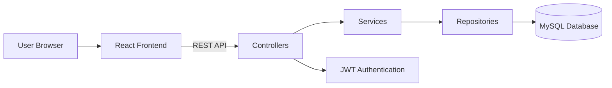
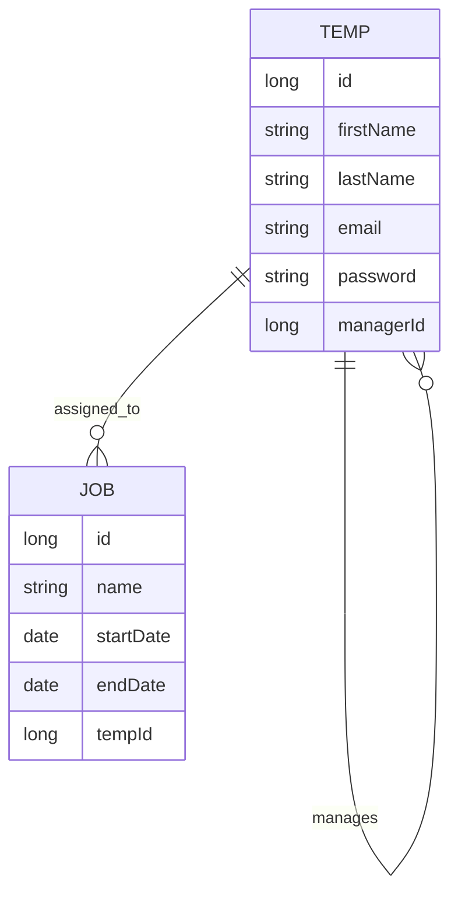
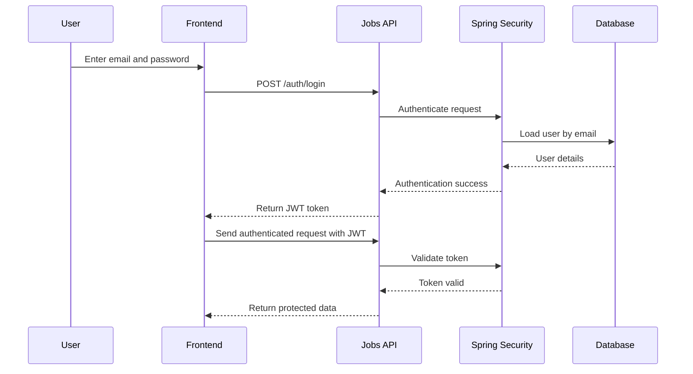

# Jobs API

REST API for managing temporary workers and job assignments with hierarchy-based access control.

Built with Spring Boot, Spring Security, JWT authentication and MySQL.

## Features

- JWT authentication
- Temp hierarchy management
- Job creation and assignment
- Prevent overlapping job bookings
- Profile management
- Hierarchy-based visibility rules
- Swagger API documentation
- Validation and structured error handling

## Architecture

The backend exposes REST endpoints consumed by the React frontend.  
Authentication is handled using JWT tokens through Spring Security.  
Business rules such as hierarchy visibility and overlapping booking prevention are enforced in the service layer.

## Tech Stack

Java  
Spring Boot  
Spring Security  
Spring Data JPA  
JWT Authentication  
MySQL  
Swagger / OpenAPI  
Maven

## Project Structure

    src/main/java/com/example/jobs
    ├── auth
    ├── common
    ├── config
    ├── jobs
    └── temps

    src/main/resources
    ├── application.properties
    └── application-test.properties

## Database ER Diagram

## JWT Authentication Flow

## API Endpoints

### Authentication

- `POST /auth/login`
- `POST /auth/logout`

### Profile

- `GET /profile`
- `PATCH /profile`

### Temps

- `POST /temps`
- `GET /temps`
- `GET /temps/{id}`
- `PATCH /temps/{id}`
- `GET /temps?jobId={jobId}`

### Jobs

- `POST /jobs`
- `GET /jobs`
- `GET /jobs/{id}`
- `PATCH /jobs/{id}`
- `GET /jobs?assigned=true`
- `GET /jobs?assigned=false`

## Business Rules

- A job can have only one temp
- A temp can have multiple jobs
- Jobs cannot overlap for the same temp
- Users can only view temps within their reporting hierarchy
- Users can only view jobs that are unassigned, assigned to themselves, or assigned to their reports

## Running the API

Run the application with:

    mvn spring-boot:run

API base URL:

    http://localhost:8080

Swagger documentation:

    http://localhost:8080/swagger-ui/index.html

## Environment Variables

Example `.env`:

    DB_HOST=localhost
    DB_PORT=3306
    DB_NAME=jobs_db
    DB_USER=root
    DB_PASSWORD=password

    JWT_SECRET=VerySecureSecretKey
    JWT_TOKEN_EXPIRY=86400000

    CORS_ALLOWED_ORIGINS=http://localhost:5173
    SERVER_PORT=8080

## Example Seed Users

- `admin@example.com / admin12345`
- `allan@example.com / allan12345`
- `sam@example.com / sam12345`
- `jamie@example.com / jamie12345`

## Future Improvements

- Add comprehensive unit tests
- Add integration tests for API endpoints
- Improve API test coverage
- Implement refresh token authentication
- Add pagination and filtering
- Dockerise the application
- Deploy backend to AWS EC2
- Use AWS RDS for the database
- Add CI/CD pipeline
- Add monitoring and logging
